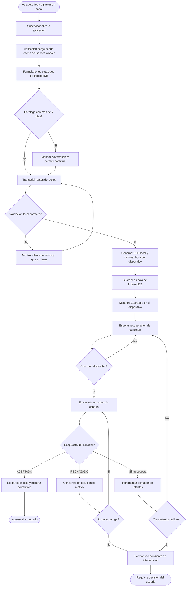
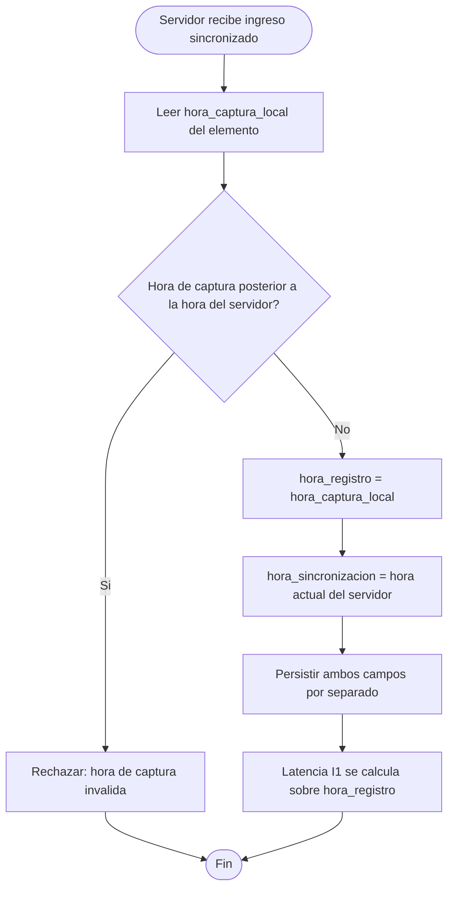
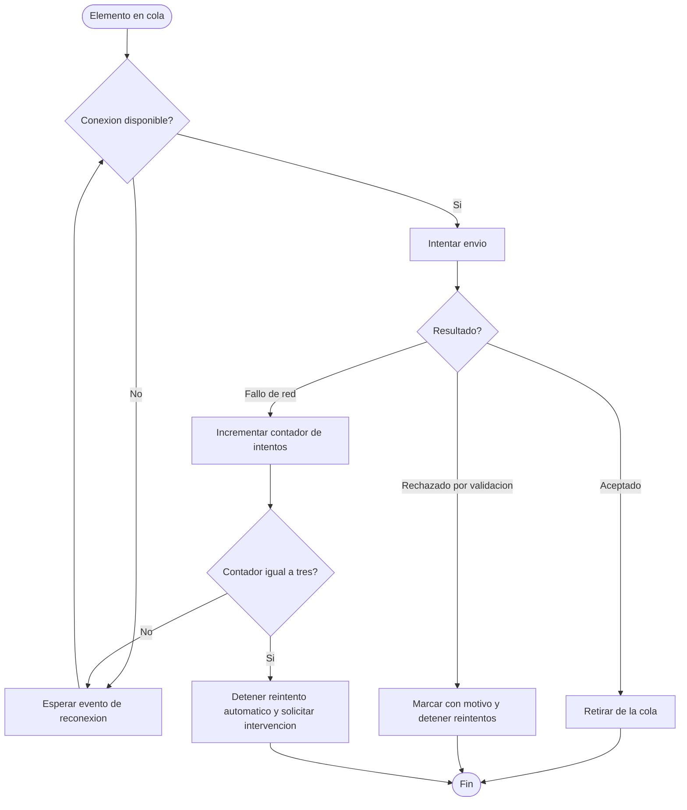

# Diagramas de actividades — M07 Captura sin conexión

## A-M07-01 · Ciclo de vida de un ingreso capturado sin conexión

## A-M07-02 · Asignación de la hora de registro en sincronización (RN-M07-01, RN-M07-02)

Este es el diagrama más importante del módulo para la confiabilidad de la medición. Si la asignación de A1 tomara la hora del servidor en lugar de la hora de captura, el indicador I1 mediría disponibilidad de red y no oportunidad del registro. El error no produciría ningún síntoma visible en el funcionamiento del sistema.

## A-M07-03 · Decisión de reintento y límite de intentos (RN-M07-09)

La distinción entre "rechazado por validación" y "fallo de red" importa: el primero no mejora reintentando —el dato es inválido y requiere corrección—, el segundo sí. Reintentar indefinidamente un elemento inválido consumiría batería y datos sin resolver nada.
