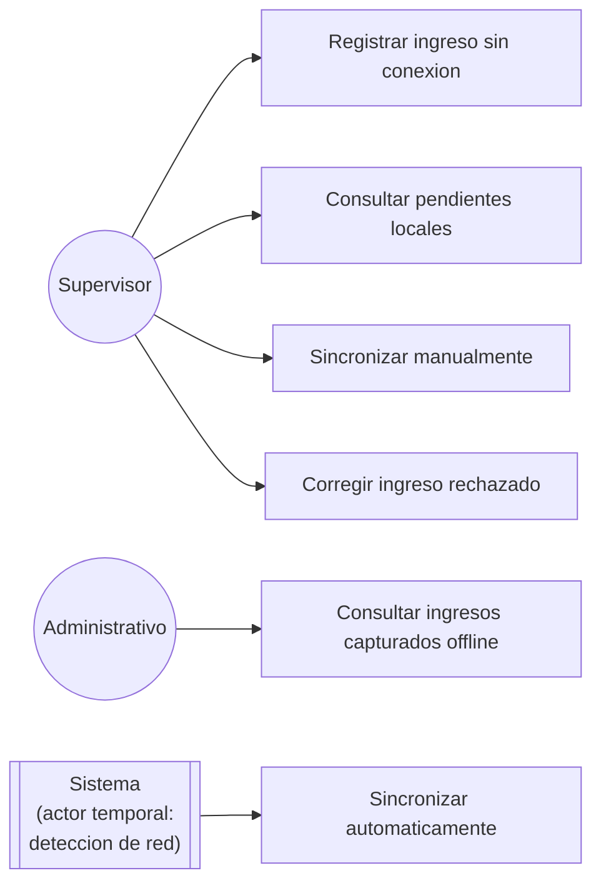

# Diagrama de casos de uso — M07 Captura sin conexión

## Nota sobre el actor Sistema

La sincronización automática (UC5) no la inicia una persona sino la detección de un evento de red. Se representa como actor temporal porque el disparador es externo a la voluntad del usuario. Es la diferencia esencial con UC3, que sí es una acción deliberada.

## Casos de uso

| Caso | HU | Actor | Precondición |
|---|---|---|---|
| Registrar ingreso sin conexión | HU-M07-02 | Supervisor | Aplicación instalada; catálogos en local |
| Consultar pendientes locales | HU-M07-02, HU-M07-05 | Supervisor | — |
| Sincronizar manualmente | HU-M07-03 | Supervisor | Conexión disponible; cola no vacía |
| Corregir ingreso rechazado | HU-M07-04 | Supervisor | Elemento en estado rechazado |
| Sincronizar automáticamente | HU-M07-03 | Sistema | Recuperación de conectividad; cola no vacía |
| Consultar ingresos capturados offline | HU-M07-05 | Administrativo | Conexión disponible |
