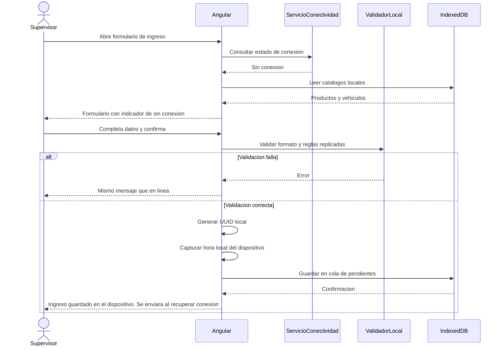
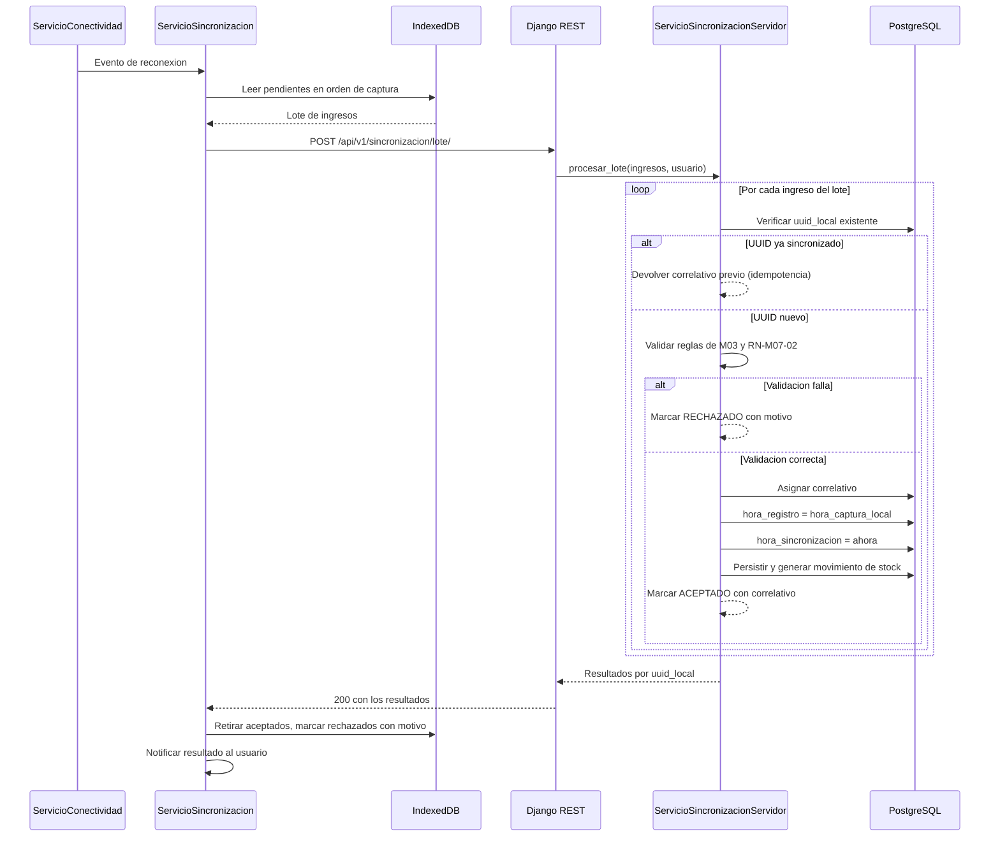
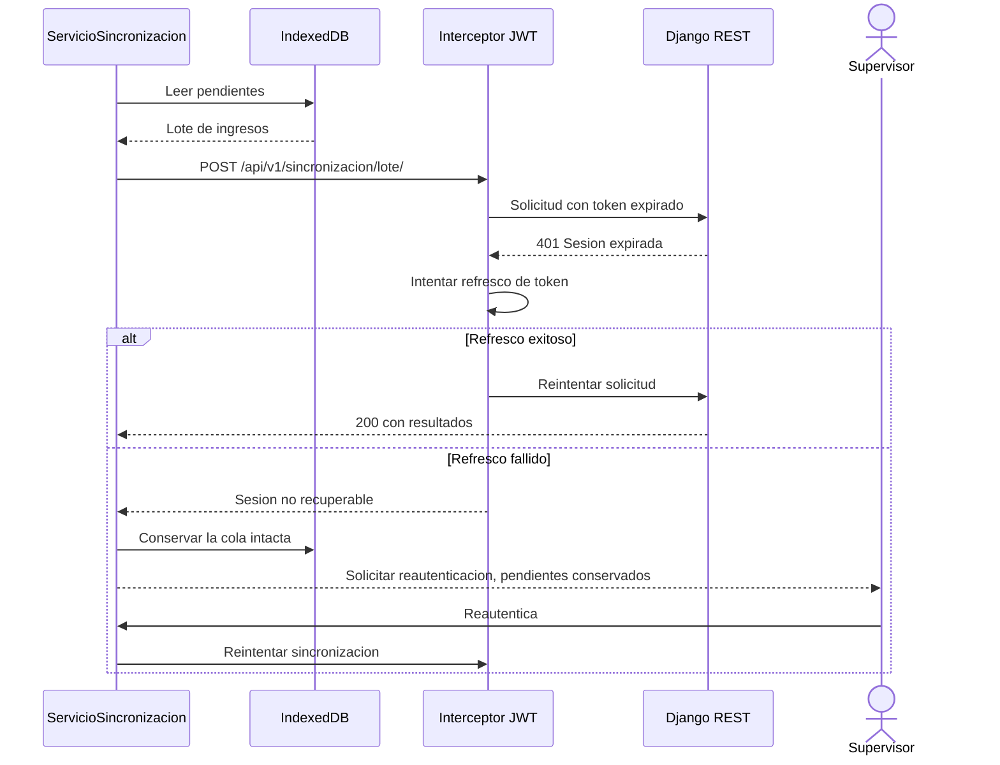
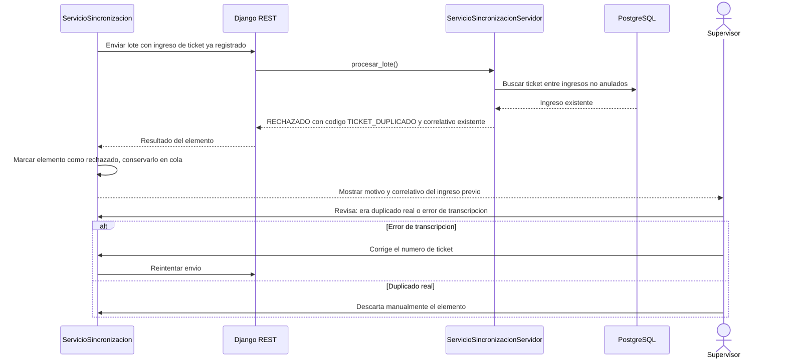

# Diagramas de secuencia — M07 Captura sin conexión

## S-M07-01 · Registro de un ingreso sin conexión (HU-M07-02)

## S-M07-02 · Sincronización automática al recuperar conexión (HU-M07-03)

## S-M07-03 · Expiración de token durante la sincronización (HU-M07-04, CA04)

La rama de refresco fallido es la que RN-M07-07 protege. La cola **no** se descarta bajo ninguna circunstancia relacionada con la sesión.

## S-M07-04 · Rechazo por ticket duplicado (HU-M07-04, CA03)

El elemento nunca se descarta de forma automática (RN-M07-06). La decisión es siempre del usuario, porque solo él puede distinguir entre un duplicado real y un error de transcripción.
