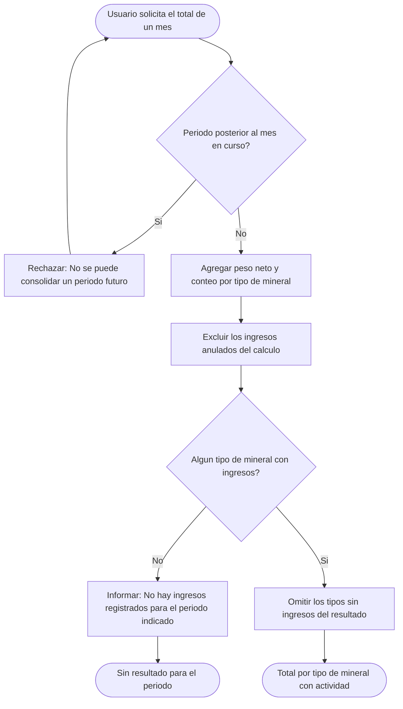
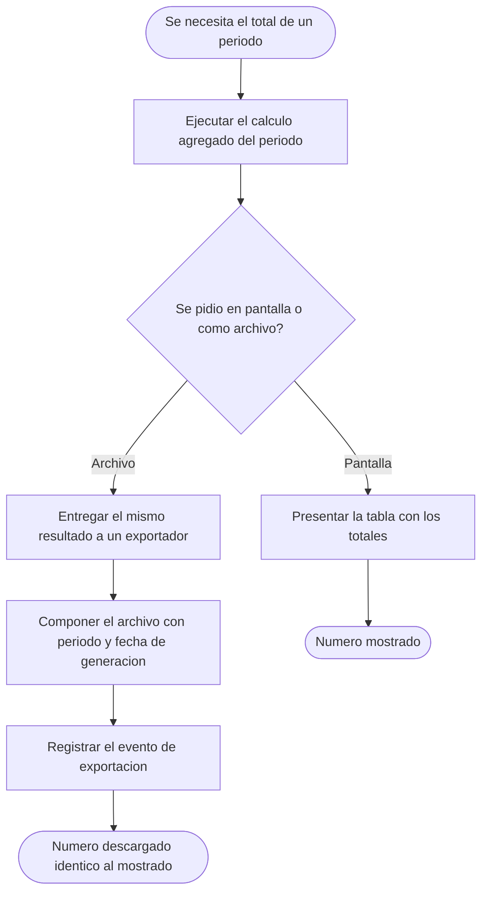

# Diagramas de actividades — M08 Consolidación de la producción

## A-M08-01 · Cálculo del consolidado mensual (RN-M08-01 a RN-M08-04)

## A-M08-02 · Consulta frente a exportación del mismo cálculo (RN-M08-05, RN-M08-06)

Ambos caminos parten del mismo cálculo agregado. Si se implementara un cálculo separado para el
archivo, cualquier diferencia de redondeo o de filtro entre ambos produciría dos cifras distintas
para el mismo mes.
