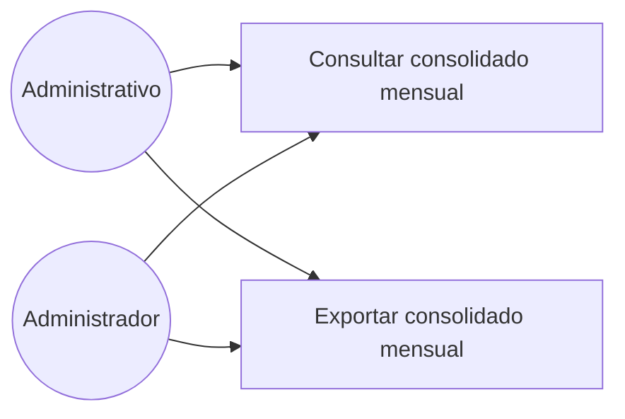

# Diagrama de casos de uso — M08 Consolidación de la producción

## Casos de uso

| Caso | HU | Actores | Nota |
|---|---|---|---|
| Consultar consolidado mensual | HU-M08-01 | Administrativo, Administrador | Total por tipo de mineral, excluyendo anulados. Calculado a demanda |
| Exportar consolidado mensual | HU-M08-02 | Administrativo, Administrador | Mismo cálculo que la consulta, entregado como archivo |

El Supervisor de planta no participa de este módulo: la consolidación es un reporte administrativo,
ajeno a su trabajo de registro en planta.

Los actores se definen en `../../M01-autenticacion/diagramas/caso_uso.md` y no se redefinen aquí.
