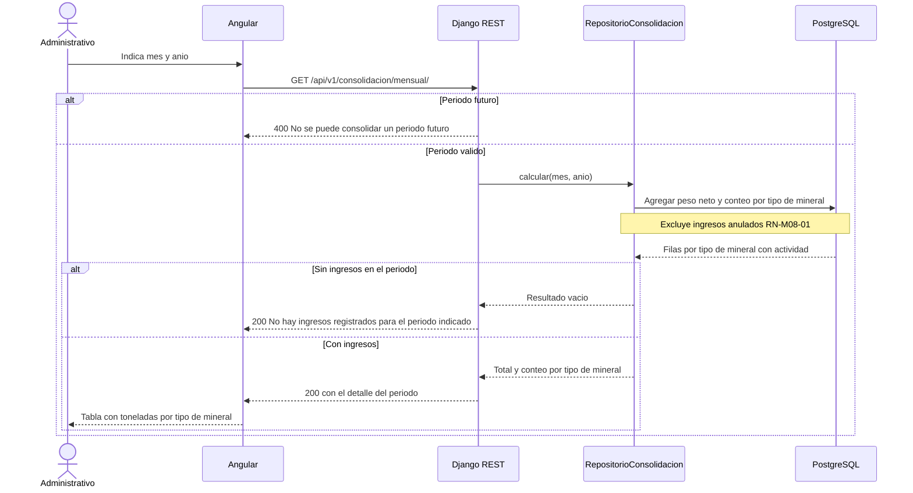
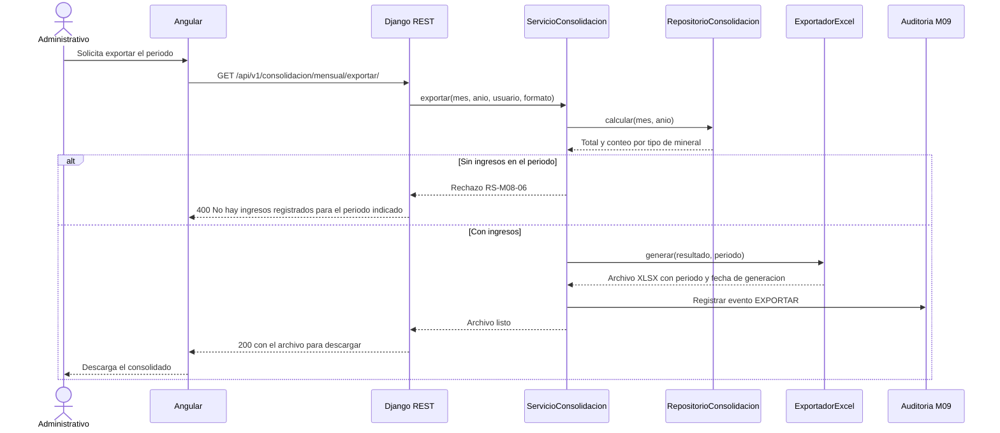

# Diagramas de secuencia — M08 Consolidación de la producción

## S-M08-01 · Consulta del consolidado mensual (HU-M08-01)

## S-M08-02 · Exportación del consolidado mensual (HU-M08-02)

El exportador se invoca después de obtener el mismo resultado que usa la consulta en pantalla
(RN-M08-05): no existe un segundo cálculo para la exportación.
