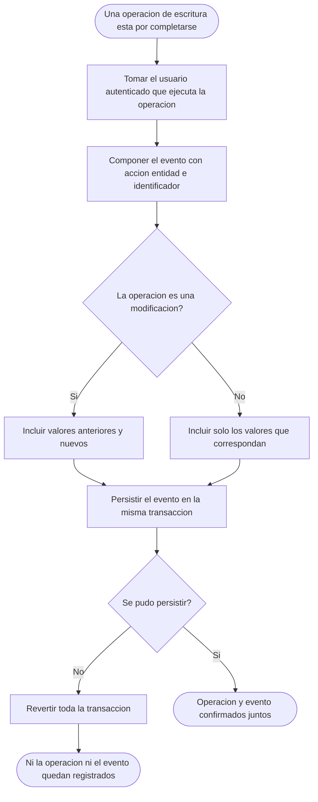
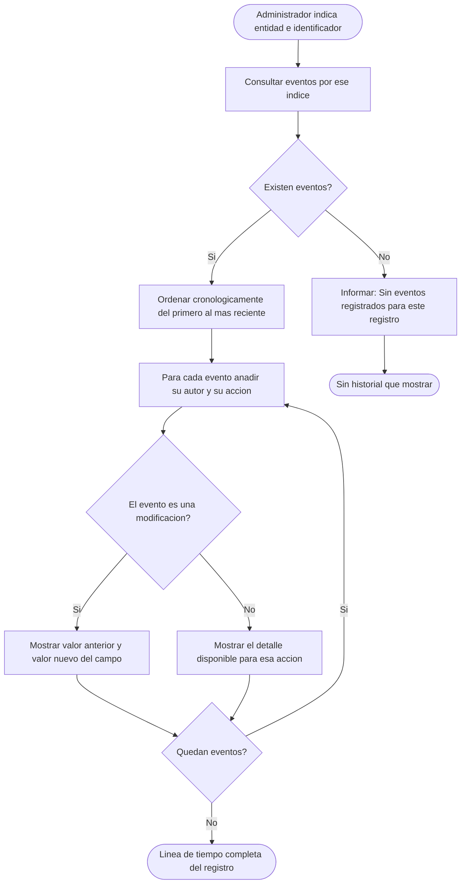
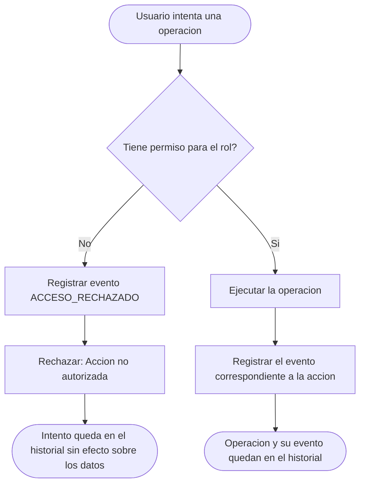

# Diagramas de actividades — M09 Auditoría

## A-M09-01 · Registro de un evento como parte de otra operación (RN-M09-01, RN-M09-06)

## A-M09-02 · Reconstrucción del historial de una entidad (RU-M09-04)

## A-M09-03 · Distinción entre operación completada y acceso rechazado (RN-M09-04)

Ambas ramas terminan con un evento registrado. La diferencia no está en si se audita, sino en qué se
audita: una es un cambio sobre los datos, la otra es la constancia de que el cambio no se permitió.
