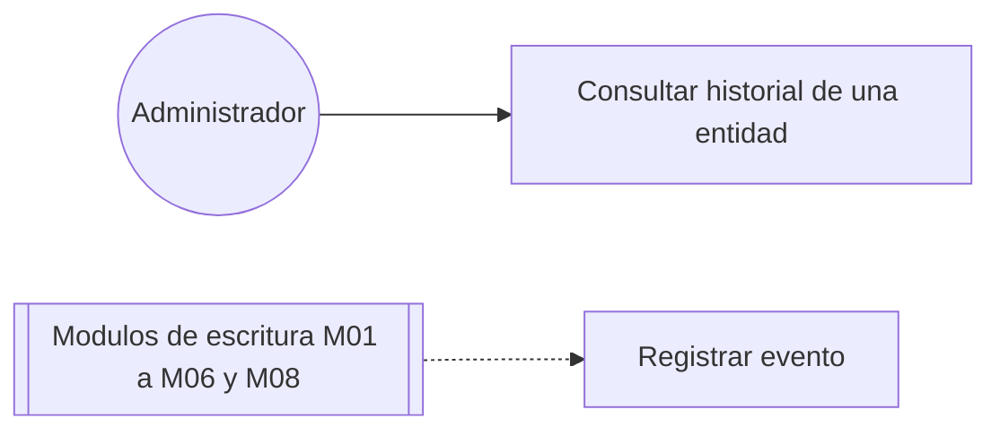

# Diagrama de casos de uso — M09 Auditoría

## Casos de uso

| Caso | HU | Actores | Nota |
|---|---|---|---|
| Registrar evento | HU-M09-01 | Todos los módulos de escritura, no un usuario | Ocurre dentro de la transacción de cada operación auditada; ningún rol lo activa directamente |
| Consultar historial de una entidad | HU-M09-02 | Administrador | Reservado al Administrador: expone información de todos los usuarios y entidades |

Los módulos de escritura se dibujan como sistemas que invocan el registro, porque quien lo hace no
es una persona sino la propia operación que se está completando.

Los actores se definen en `../../M01-autenticacion/diagramas/caso_uso.md` y no se redefinen aquí.
