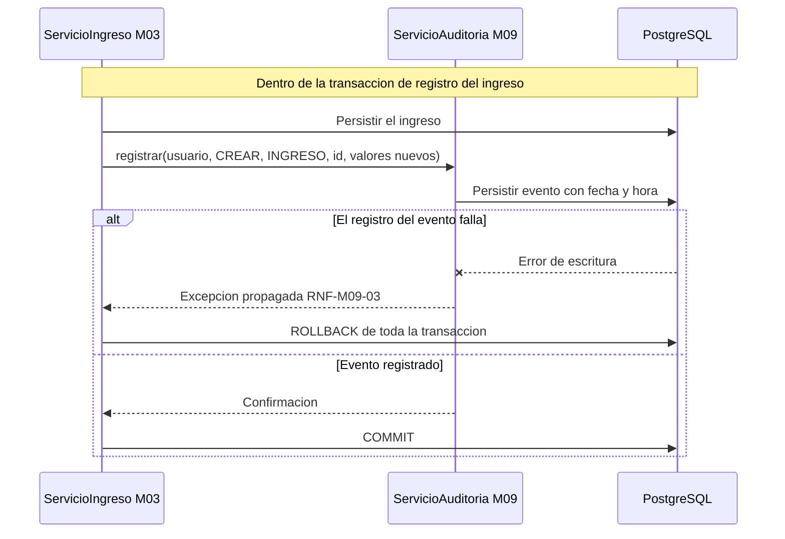
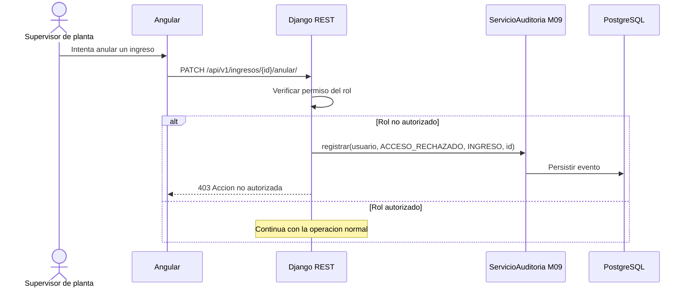
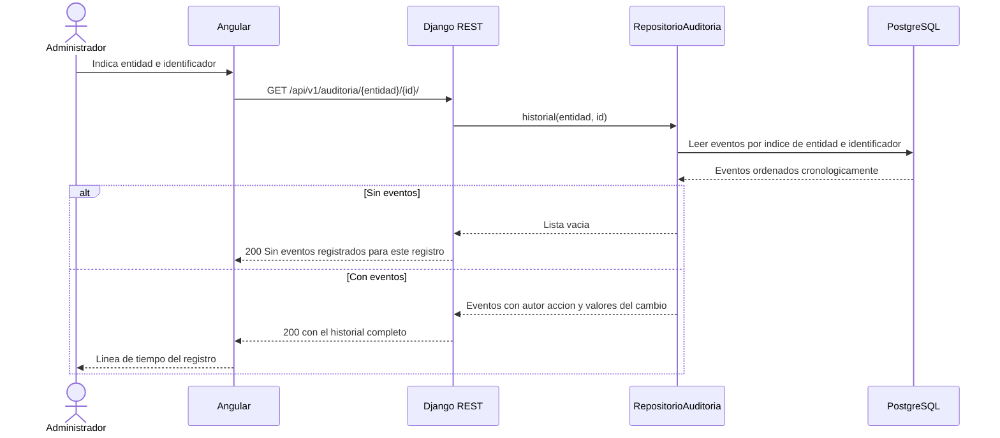

# Diagramas de secuencia — M09 Auditoría

## S-M09-01 · Registro de un evento dentro de otra operación (HU-M09-01)

El servicio de auditoría no abre su propia transacción: participa de la del módulo que lo invoca. Si
el evento no puede escribirse, toda la operación se revierte (RN-M09-01, RNF-M09-03).

## S-M09-02 · Registro de un acceso rechazado (HU-M09-01)

El intento rechazado se registra con el mismo rigor que uno completado: RN-M09-04 exige que el
control de acceso pueda demostrarse, no solo asumirse.

## S-M09-03 · Consulta del historial de una entidad (HU-M09-02)

