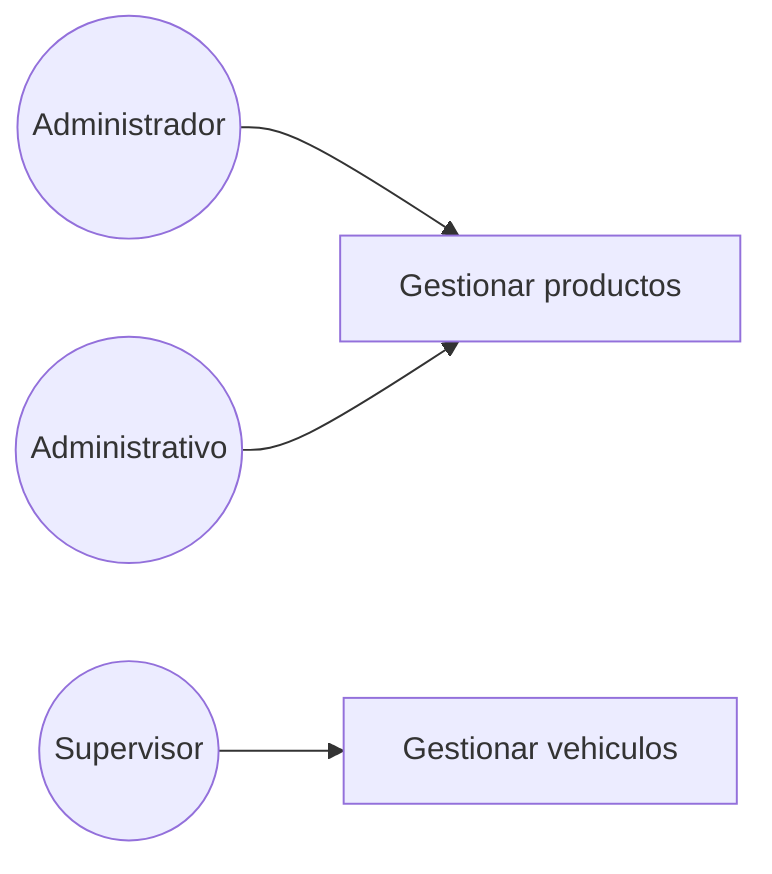
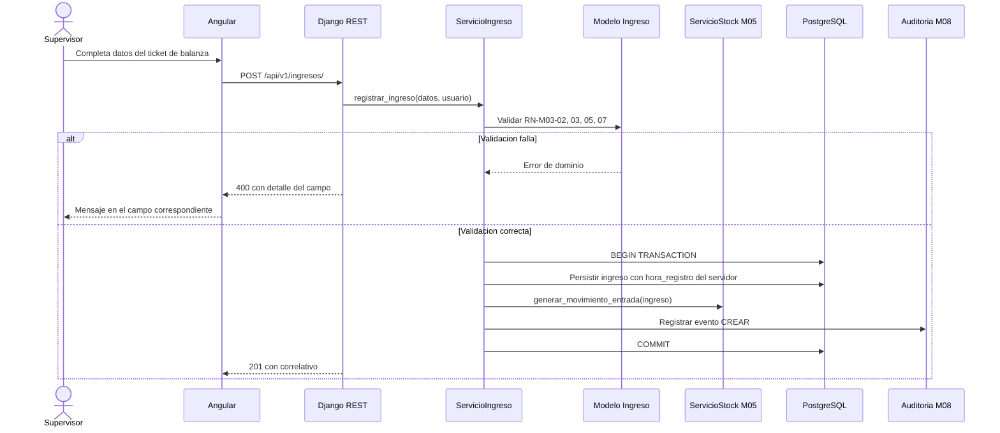
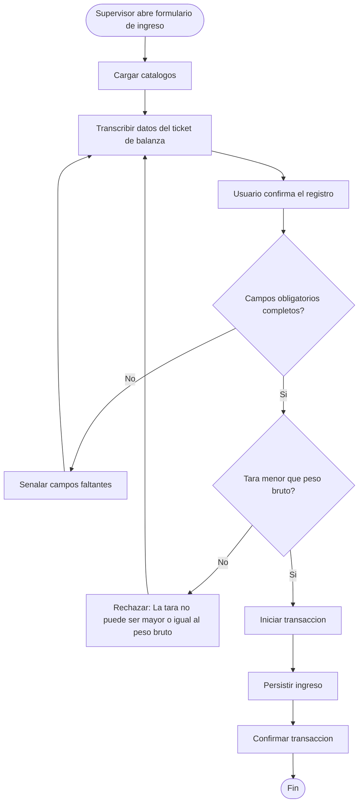

# Diagramas Mermaid

Carga antes `contexto-tesis`. Referencia de estilo: `docs/modulos/M03-ingresos/diagramas/`.

## Regla que no se negocia: etiquetas sin tildes ni eñes

Dentro de un bloque ```mermaid, **todo texto de nodo, participante, etiqueta de flecha o rama va sin
tildes, sin eñes y sin signos `¿` `¡`**. El repositorio entero lo cumple: `Validacion`, `vehiculo`,
`auditoria`, `transaccion`, `Senalar campos faltantes`, `numero`.

Es deliberado: evita fallos de renderizado en los visores de Markdown y en la exportación a Word del
documento de tesis. La prosa que rodea al diagrama —títulos, tablas, notas— **sí lleva tildes
normales**. La regla aplica exclusivamente al interior del bloque de código.

Otras restricciones dentro del bloque:

- Sin paréntesis, comas ni comillas dentro de `[...]` o `{...}`. Usa guiones o reescribe.
- Sin `<br/>` ni HTML.
- Los identificadores de nodo son cortos y mnemotécnicos: `V1`, `E2`, `UC3`, `SRV`, `DB`.
- El signo `?` final en un rombo de decisión sí se admite: `{Tara menor que peso bruto?}`.

---

## `caso_uso.md`

```markdown
# Diagrama de casos de uso — M{nn} {Nombre}



## Casos de uso

| Caso | HU | Actores | Nota |
|---|---|---|---|
| Gestionar productos | HU-M02-01 | Administrador, Administrativo | Incluye alta, edición y baja lógica |

Los actores se definen en `../../M01-autenticacion/diagramas/caso_uso.md` y no se redefinen aquí.
```

- `flowchart LR`, actores como círculos `(("Nombre"))`, casos como cajas `["Verbo objeto"]`.
- Identificadores fijos de actor: `ADM`, `ADV`, `SUP`. Casos: `UC1`, `UC2`, …
- El caso de uso se nombra con **verbo en infinitivo + objeto**: «Gestionar vehiculos»,
  «Consultar catalogos», «Registrar ingreso».
- La **tabla es obligatoria** y es donde vive el detalle con tildes: HU asociada, actores y el matiz
  que el dibujo no puede expresar («La titularidad es obligatoria», «El Supervisor solo consulta»).
- Cierra siempre con la línea que remite a M01 para la definición de actores.

---

## `secuencia.md`

Uno o más diagramas, cada uno titulado `## S-M{nn}-{nn} · {Escenario} (HU-M{nn}-{nn})`.

```markdown
## S-M03-01 · Registro de un ingreso en línea (HU-M03-01)


```

**Participantes canónicos.** Reutiliza estos nombres en todo el repositorio; no inventes variantes:

| Alias | Participante |
|---|---|
| `NG` | Angular |
| `API` | Django REST |
| `SRV` | `Servicio{Entidad}` |
| `DOM` | `Modelo {Entidad}` |
| `DB` | PostgreSQL |
| `STK` | `ServicioStock M05` |
| `AUD` | `Auditoria M08` |
| `COR` | `GeneradorCorrelativo` |
| `SW` | `Service Worker` (M07) |
| `IDB` | `IndexedDB` (M07) |

El actor se declara con `actor`, el resto con `participant`. Los módulos externos llevan su código
(`M05`, `M08`) en el nombre para que la dependencia sea visible.

**Contenido obligatorio de todo diagrama de escritura:**

1. Bloque `alt … else …` con la rama de error **antes** de la de éxito.
2. `BEGIN TRANSACTION` … `COMMIT` explícitos cuando la operación toca más de una tabla.
3. La llamada a `AUD` dentro de la transacción.
4. Los códigos HTTP reales en las respuestas al cliente: `201`, `400`, `403`, `409`.
5. Las reglas de negocio citadas por código en la flecha de validación.

Los mensajes describen **qué se hace**, no cómo: `obtener_siguiente_correlativo()`,
`Persistir ingreso con hora_registro del servidor`.

---

## `actividades.md`

Uno o más diagramas, titulados `## A-M{nn}-{nn} · {Proceso} ({reglas que verifica})`.

```markdown
## A-M03-01 · Registro de un ingreso (RN-M03-01 a RN-M03-08)


```

- `flowchart TD`. Inicio y fin con `([...])`, acciones con `[...]`, decisiones con `{...?}`.
- Ramas etiquetadas `|Si|` y `|No|` — sin tilde en «Si».
- **Toda rama de error retorna al paso de captura** (`E1 --> L1`), no muere en un nodo suelto.
- Prefijos: `V` validación, `E` error, `T` transacción, `P` persistencia, `A` asignación,
  `C` carga, `M` mensaje, `D` decisión de negocio.
- Los nodos de rechazo llevan el mensaje literal del criterio de aceptación, sin tildes.

Además del flujo principal, incluye los diagramas de **decisión de negocio** que el módulo necesite
—«Decisión entre editar y anular», «Composición del indicador I4»— y, cuando el módulo alimenta un
indicador, el diagrama de **cálculo del indicador** sobre los datos del módulo.

---

---

## Diagramas de arquitectura (C4 y entidad-relación)

Viven en `docs/00-arquitectura/`, no en un módulo, y siguen las mismas reglas de etiquetas sin tildes.

**C4 nivel 1 (contexto) y nivel 2 (contenedores)** son evidencia visual del indicador «número de
módulos implementados» de la variable independiente. El nivel 2 debe reflejar exactamente los
contenedores reales del sistema: SPA Angular, service worker con IndexedDB, API Django REST,
PostgreSQL. El nivel 3 (componentes) es opcional; hazlo solo para M03 o M07, que son los que se
explican en sustentación.

No inventes contenedores que el despliegue no tiene. Si no hay almacenamiento de imágenes en el
alcance, no lo dibujes: un diagrama que promete más de lo implementado baja el porcentaje de módulos
cumplidos cuando el jurado lo contrasta.

**Modelo entidad-relación:** `erDiagram` de Mermaid, con la cardinalidad explícita
(`USUARIO ||--o{ INGRESO : registra`). La fuente única es
`docs/00-arquitectura/modelo_datos_entidad_relacion.md`; si tu diagrama y esa tabla discrepan, la
tabla manda.

---

## Verificación final

- [ ] Ningún carácter acentuado, `ñ`, `¿` o `¡` dentro de un bloque ```mermaid.
- [ ] Sin paréntesis ni comas dentro de `[...]` y `{...}`.
- [ ] Todo diagrama titulado con su código `S-M**-**` o `A-M**-**` y la HU o RN que representa.
- [ ] `caso_uso.md` cierra con la remisión a M01.
- [ ] Los diagramas de escritura muestran transacción, auditoría y rama de error.
