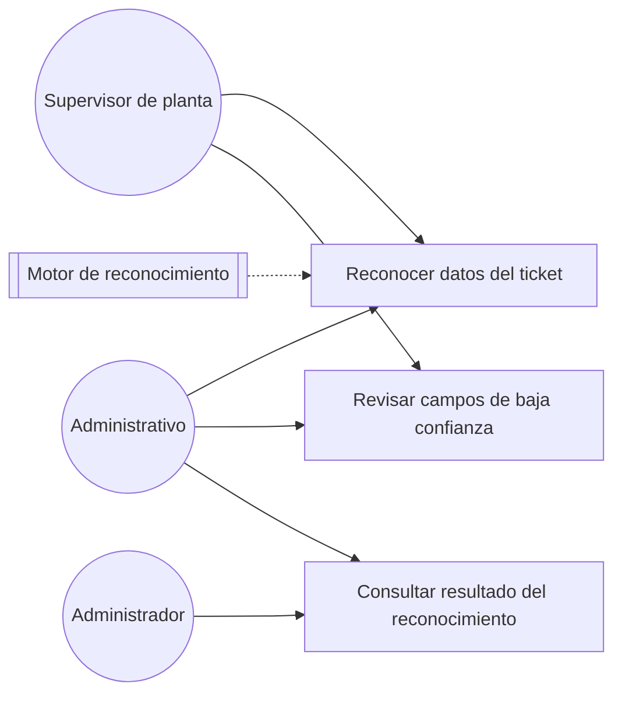
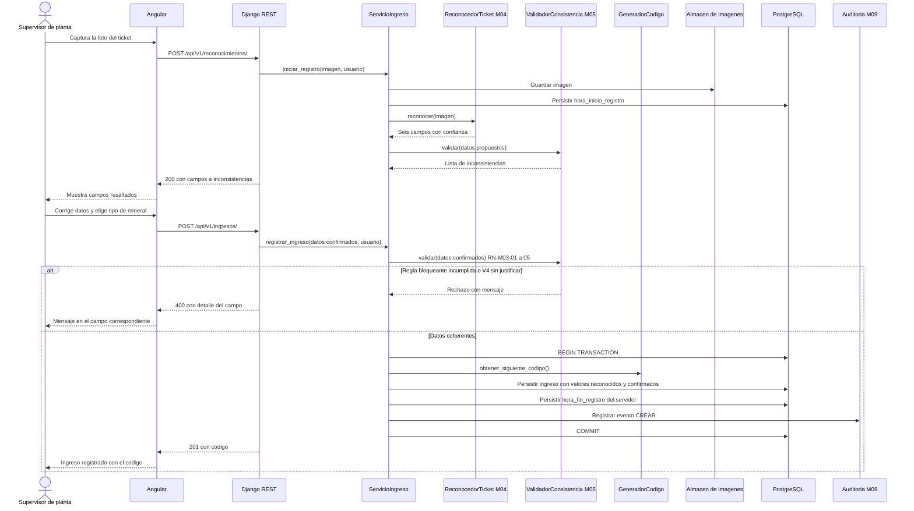
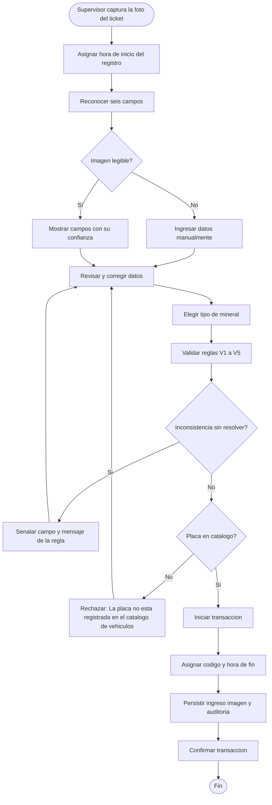

# Diagramas Mermaid

Carga antes `contexto-tesis`. Referencia de estilo: `docs/modulos/M03-ingresos/diagramas/` (en
reescritura para el sistema web inteligente; donde su versión actual contradiga esta skill, manda
la skill).

## Regla que no se negocia: etiquetas sin tildes ni eñes

Dentro de un bloque ```mermaid, **todo texto de nodo, participante, etiqueta de flecha o rama va sin
tildes, sin eñes y sin signos `¿` `¡`**. El repositorio entero lo cumple: `Validacion`, `vehiculo`,
`auditoria`, `transaccion`, `Senalar campos faltantes`, `codigo`.

Es deliberado: evita fallos de renderizado en los visores de Markdown y en la exportación a Word del
documento de tesis. La prosa que rodea al diagrama —títulos, tablas, notas— **sí lleva tildes
normales**. La regla aplica exclusivamente al interior del bloque de código.

Otras restricciones dentro del bloque:

- Sin paréntesis, comas ni comillas dentro de `[...]` o `{...}`. Usa guiones o reescribe.
- Sin `<br/>` ni HTML.
- Los identificadores de nodo son cortos y mnemotécnicos: `V1`, `E2`, `UC3`, `SRV`, `DB`.
- El signo `?` final en un rombo de decisión sí se admite: `{Imagen legible?}`.

---

## `caso_uso.md`

```markdown
# Diagrama de casos de uso — M{nn} {Nombre}



## Casos de uso

| Caso | HU | Actores | Nota |
|---|---|---|---|
| Reconocer datos del ticket | HU-M04-01 | Supervisor de planta, Administrativo | El resultado es una propuesta; no se persiste sin confirmación |
| Revisar campos de baja confianza | HU-M04-01 | Supervisor de planta, Administrativo | Umbral por defecto de 0,80 |

Los actores se definen en `../../M01-autenticacion/diagramas/caso_uso.md` y no se redefinen aquí.
```

- `flowchart LR`, actores como círculos `(("Nombre"))`, casos como cajas `["Verbo objeto"]`.
  Un sistema externo (el motor de reconocimiento cuando D-12 elija un servicio) se dibuja como
  `[["Nombre"]]` y se une con línea discontinua `-.->`.
- Identificadores fijos de actor: `ADM`, `ADV`, `SUP`. Casos: `UC1`, `UC2`, …
- El caso de uso se nombra con **verbo en infinitivo + objeto**: «Gestionar vehiculos»,
  «Registrar ingreso», «Vincular ingreso con etapa».
- La **tabla es obligatoria** y es donde vive el detalle con tildes: HU asociada, actores y el matiz
  que el dibujo no puede expresar («La placa debe existir en el catálogo», «El Supervisor de planta
  no anula»).
- Cierra siempre con la línea que remite a M01 para la definición de actores.

---

## `secuencia.md`

Uno o más diagramas, cada uno titulado `## S-M{nn}-{nn} · {Escenario} (HU-M{nn}-{nn})`.

```markdown
## S-M03-01 · Registro de un ingreso con reconocimiento y validación (HU-M03-01, HU-M04-01, HU-M05-01)


```

**Participantes canónicos.** Reutiliza estos nombres en todo el repositorio; no inventes variantes:

| Alias | Participante |
|---|---|
| `NG` | Angular |
| `API` | Django REST |
| `SRV` | `Servicio{Entidad}` |
| `DOM` | `Modelo {Entidad}` |
| `DB` | PostgreSQL |
| `REC` | `ReconocedorTicket M04` (interfaz; el motor concreto lo fija D-12) |
| `VAL` | `ValidadorConsistencia M05` |
| `COR` | `GeneradorCodigo` |
| `IMG` | `Almacen de imagenes` |
| `LOT` | `ServicioLote M06` |
| `AUD` | `Auditoria M09` |

El actor se declara con `actor`, el resto con `participant`. Los módulos externos llevan su código
(`M04`, `M05`, `M09`) en el nombre para que la dependencia sea visible. `REC` y `VAL` son
interfaces inyectadas en el servicio de registro: el diagrama nunca nombra el motor concreto.

**Contenido obligatorio de todo diagrama de escritura:**

1. Bloque `alt … else …` con la rama de error **antes** de la de éxito.
2. `BEGIN TRANSACTION` … `COMMIT` explícitos cuando la operación toca más de una tabla.
3. La llamada a `AUD` dentro de la transacción.
4. Los códigos HTTP reales en las respuestas al cliente: `201`, `400`, `403`, `409`.
5. Las reglas de negocio citadas por código en la flecha de validación.
6. En los flujos que persisten datos reconocidos, la confirmación del usuario como paso explícito
   entre la propuesta y la persistencia.

Los mensajes describen **qué se hace**, no cómo: `obtener_siguiente_codigo()`,
`Persistir hora_fin_registro del servidor`.

---

## `actividades.md`

Uno o más diagramas, titulados `## A-M{nn}-{nn} · {Proceso} ({reglas que verifica})`.

```markdown
## A-M03-01 · Registro de un ingreso a partir del ticket (RN-M03-01 a RN-M03-08)


```

- `flowchart TD`. Inicio y fin con `([...])`, acciones con `[...]`, decisiones con `{...?}`.
- Ramas etiquetadas `|Si|` y `|No|` — sin tilde en «Si».
- **Toda rama de error retorna al paso de captura o corrección** (`E1 --> L2`), no muere en un
  nodo suelto.
- Prefijos: `V` validacion, `R` reconocimiento, `E` error, `T` transaccion, `P` persistencia,
  `A` asignacion, `C` carga, `L` captura o correccion del usuario, `D` decision.
- Los nodos de rechazo llevan el mensaje literal del criterio de aceptación, sin tildes.

Además del flujo principal, incluye los diagramas de **decisión de negocio** que el módulo necesite
—«Decisión entre corregir y anular», «Resolución de una inconsistencia V4 con justificación»,
«Asignación de un ingreso a un lote de proceso»—.

---

## Diagramas de arquitectura (C4 y entidad-relación)

Viven en `docs/model-c4/` y `docs/00-arquitectura/`, no en un módulo, y siguen las mismas reglas de
etiquetas sin tildes.

**C4 nivel 1 (contexto):** la balanza no se integra; su ticket se fotografía y se reconoce. Si D-12
elige un servicio en la nube, el motor de reconocimiento aparece como sistema externo.
**C4 nivel 2 (contenedores):** exactamente los contenedores reales del despliegue: SPA Angular, API
Django REST, PostgreSQL, almacén de imágenes y motor de reconocimiento (externo o local según D-12).
**C4 nivel 3 (componentes):** solo para M03, M04 y M05, que son los que se explican en
sustentación; muestra `ReconocedorTicket` y `ValidadorConsistencia` inyectados en el servicio de
registro.

No inventes contenedores que el despliegue no tiene ni omitas los que sí tiene: un diagrama que
promete más o menos de lo implementado se contradice con la lista de control cuando el jurado lo
contrasta.

**Modelo entidad-relación:** `erDiagram` de Mermaid, con la cardinalidad explícita
(`INGRESO ||--o| RECONOCIMIENTO_TICKET : produce`). La fuente única es
`docs/00-arquitectura/modelo_datos_entidad_relacion.md`; si tu diagrama y esa tabla discrepan, la
tabla manda.

---

## Verificación final

- [ ] Ningún carácter acentuado, `ñ`, `¿` o `¡` dentro de un bloque ```mermaid.
- [ ] Sin paréntesis ni comas dentro de `[...]` y `{...}`.
- [ ] Todo diagrama titulado con su código `S-M**-**` o `A-M**-**` y la HU o RN que representa.
- [ ] `caso_uso.md` cierra con la remisión a M01.
- [ ] Los diagramas de escritura muestran transacción, auditoría, rama de error y, si aplica,
      la confirmación del usuario antes de persistir datos reconocidos.
- [ ] Ningún diagrama nombra el motor de reconocimiento concreto: solo `ReconocedorTicket`.
